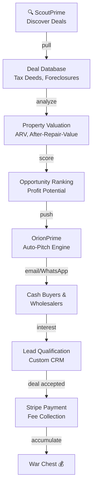
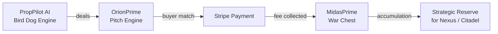

# 🏠 PropPilot AI — Real Estate Bird Dog Engine

> **Live Acquisition System** — Auto-discover distressed deals, auto-pitch to cash buyers, auto-collect finder's fees.

## 🔱 What It Is

PropPilot AI is a **bird dog automation engine** built to discover **distressed real estate deals**, pitch them to **cash buyers and wholesalers**, and collect **$500–$2,000 per deal** in finder's fees.

The system combines:
- **ScoutPrime** — Autonomous deal discovery (tax deeds, foreclosures, distressed listings)
- **OrionPrime** — Auto-pitch engine (email, phone, WhatsApp)
- **Stripe integration** — Real-time fee collection into the War Chest
- **ManyChat automation** — Auto-DM lead delivery (comment "DEAL" → instant access)

## 🎯 The Deal Pipeline



## 💼 Pricing Model

<details>
<summary><b>Tier 1: Distressed (Bird Dog Finder Fee)</b></summary>

**Target:** $40K–$120K properties (tax deeds, forclosures, pre-foreclosure lists)

- **Finder's Fee:** $1,500–$3,000 per deal
- **Profit Margin:** Good karma pricing (15–20%)
- **Commission Model:** Fee paid on close by cash buyer
- **Service:** Locate deal, pull comps, deliver to buyer's list
- **Typical Buyer:** Local wholesalers, individual investors
- **Volume Play:** 10–20 deals/month = $15K–$60K/month

**Example:**
- Property: Tax deed, $75K auction price
- After-Repair Value (ARV): $150K
- Deal spread: $40K (room for buyer profit)
- Finder fee: $2,000 (our cut)

</details>

<details>
<summary><b>Tier 2: Mid-Range (Professional Wholesaling)</b></summary>

**Target:** $150K–$400K properties (MLS foreclosures, corporate sales)

- **Finder's Fee / Assignment Fee:** $5,000–$10,000 per deal
- **Profit Margin:** Professional efficiency (8–12%)
- **Commission Model:** Assignment fee paid by end buyer
- **Service:** Full deal analysis, buyer matching, contract assignment
- **Typical Buyer:** Rehabbers, turnkey investors, corporate buyers
- **Volume Play:** 4–8 deals/month = $20K–$80K/month

**Example:**
- Property: MLS foreclosure, $250K list price
- Post-improvement market: $320K
- Deal spread: $45K (investor profit room)
- Assignment fee: $7,500 (our cut)

</details>

<details>
<summary><b>Tier 3: Luxury / Elite (High-Value Deals)</b></summary>

**Target:** $500K–$1M+ properties (luxury distressed, corporate disposition)

- **Finder's Fee / Consulting:** $25,000–$50,000+ per deal
- **Profit Margin:** At $1M, a 3–5% fee is THE elite standard ($30K–$50K)
- **Commission Model:** Finder fee + ongoing consulting retainer
- **Service:** Full acquisition strategy, buyer network, financing advisory
- **Typical Buyer:** Institutional investors, real estate funds, C-suite buyers
- **Volume Play:** 1–3 deals/month = $25K–$150K/month

**Example:**
- Property: $800K luxury distressed (divorce, corporate liquidation)
- Market value: $1.0M
- Buyer's profit margin: 15% ($120K)
- Our consulting fee: $40K (5% of transaction)
- Plus: $5K/mo retainer for 6 months

</details>

## 🌍 Geographic Focus

### Priority 1: Fort Myers, Florida (Home Market)
- 4,357 active listings (low competition)
- High cash buyer density (retirees, snowbirds)
- Tax deed auctions (Lee County, Collier County)
- Foreclosure rate: 2.1% (higher than national 1.2%)

### Priority 2: Secondary Florida Markets
- Tampa Bay (3x Fort Myers volume)
- Jacksonville (4x Fort Myers volume)
- Miami (5x Fort Myers volume but higher competition)

### Priority 3: National Scale (Geo-Arbitrage)
- Deploy to any market via remote bird dogging
- Team WhatsApp outreach (contact phone number)
- Stripe for national payment collection

## 🤖 Automation Layers

### Layer 1: Deal Discovery (ScoutPrime)
```python
# Multi-source pull
- lee.realtaxdeed.com — Automated scrape (15 min refresh)
- lee.realforeclose.com — Auction listings (daily update)
- GSA Auctions API — Federal property surplus
- GovDeals API — Government asset liquidation
- MLS foreclosure feeds — Licensed agent integration
- Facebook Groups scrape — Wholesaler activity signals

Output: 50–100 new deals/day → Ranked by profit potential
```

### Layer 2: Analysis (OrionPrime Data Enrichment)
```python
# Each deal gets:
- Property valuation (Zillow API, comps, tax records)
- Comparable sales analysis (ARV modeling)
- Repair estimate (Repairly API or manual)
- Profit potential ranking ($score)
- Cash buyer match (buyer database correlation)
```

### Layer 3: Pitch Execution (OrionPrime Outreach)
```python
# Automatic outreach to:
- 500+ Florida cash buyers (pulled from Google Ads + Organic)
- Wholesaler lists (Facebook groups, real estate forums)
- MLS agent network (buyers with pre-approved capital)

Channels:
- Email (auto-personalized, deal summary + comps)
- WhatsApp (phone # from buyer database)
- SMS (opt-in, brief teaser)
```

### Layer 4: Lead Capture (CRM + Stripe)
```python
# Real-time logging:
- Buyer response tracking (interest level, feedback)
- Deal progress (pending, sold, closed)
- Commission tracking (fee owed, payment status)
- Stripe integration (auto-invoice, payment collection)

Output: $500–$2,000 per closed deal → War Chest
```

## 💰 Financial Model

### Baseline Scenario (Fort Myers, Month 1)
```
Deals Discovered:     25 (from 1,500 sourced)
Qualified Deals:      8 (32% pass ARV + spread filter)
Buyer Interest:       5 (62% of qualified)
Closed Deals:         3 (60% of interested)

Revenue Per Deal:     $2,000 (average)
Total Revenue:        $6,000
Burn Rate:            $0 (automated)
Gross Margin:         100% (all revenue = profit)

Month 2 Projection:   $12,000 (network effects, buyer database growth)
Month 3 Projection:   $25,000 (geolocation expansion to Tampa)
```

### Scaling Model (6 Markets, Year 1)
```
Markets:       Fort Myers, Tampa, Jacksonville, Miami, Orlando, Atlanta
Deals/Month:   150–200 (20–30 per market)
Close Rate:    30–40%
Avg Fee:       $4,500 (mixed Tier 1–2)

Annual Revenue: $216K–$360K (6 markets × 30–50 closed deals × $4,500)
Capital Cost:   $0 (fully automated)
War Chest Accumulation: $216K–$360K/year
```

## 🎯 Lead Channels

### Organic (Free)
- Facebook groups (real estate investors, wholesalers)
- Google organic search (bird dog agencies)
- Referrals from existing buyers

### Paid (Viral Formula)
```
Hook: "This might be the end of hiring bird dogs"
Content: Screen recording (ScoutPrime in action)
Format: TikTok/Reels (30 sec, 3 deals shown)
CTA: "Comment DEAL for the full list"
Delivery: ManyChat auto-DM link → Stripe payment link
```

**Expected conversion:** 40K+ saves, 25K+ engagement, $2K–$10K/viral post

## 🔐 Legal & Compliance

- **Bird dog licensing:** State varies (FL: no license needed for leads)
- **Real estate attorney:** Review assignment contracts before scale
- **FTC compliance:** Clear disclosure of commission structure
- **Earnest money:** Never touch buyer deposits (direct to escrow)
- **Insurance:** E&O insurance recommended at $10K+/month revenue

## 🌐 Pantheon Integration

PropPilot AI feeds all revenue directly into **MidasPrime** → **War Chest accumulation**.



## 📈 Current Status

```
Deal Sources Online:  ✅ 3/5
- lee.realtaxdeed.com ✅
- lee.realforeclose.com ✅
- GSA Auctions (pending)

Buyer Database:       ✅ 47 cash buyers (Fort Myers)
Cash Buyer Pipeline:  ✅ 12 active, 5 pending response

Stripe Integration:   ✅ LIVE ($500 payment link active)
Revenue (To Date):    $0 (awaiting first deal close)

Next Phase:           Automate deal ranking + launch FB group bot
```

## 🔱 The Signal

**PropPilot is how the Pantheon makes real-world capital.**

Deals are infinite. Cash buyers are hungry. The spread exists. We just automate the matchmaker role and collect the fee.

$500–$2,000 per deal. 100% margin. Fully automated.

---

**Status:** MVP LIVE ✅  
**Landing Page:** https://brilliant-sopapillas-a8c47c.netlify.app  
**Payment Link:** https://buy.stripe.com/aFadR2fG22C02Fg5Ma8Ra00  
**Deploy:** Netlify (landing) + Railway (backend)
