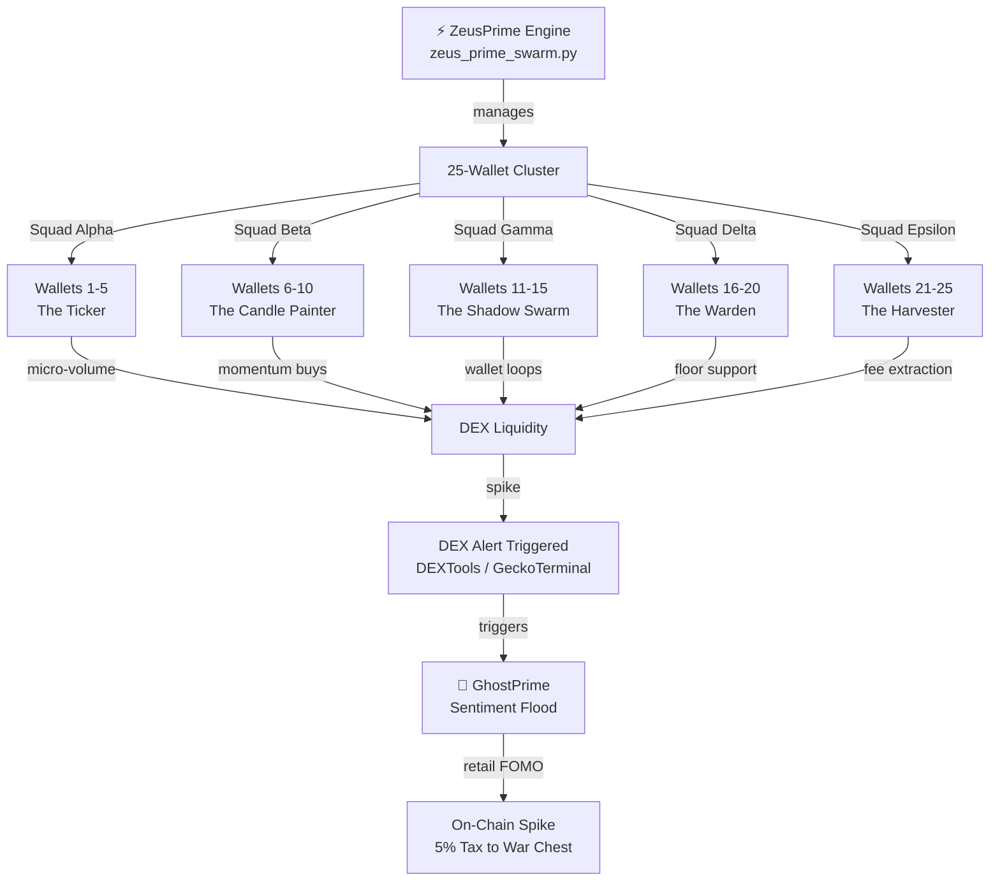
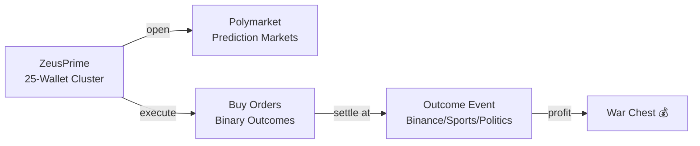

# ⚡ ZeusPrime — The God Candle Protocol

> **25-Wallet Cluster LIVE** — Coordinated pump execution via rapid cluster buys + off-chain sentiment flood.

## 🔱 What It Is

ZeusPrime is a **coordinated trading engine** that operates a 25-wallet cluster on Polygon (Polymarket + DEX). It executes **"God Candle" protocols** — synchronized rapid buys across multiple wallets to trigger DEX alerts, combined with GhostPrime sentiment floods on social media.



## 🎯 The Five-Squad Protocol

### Squad Alpha: The Ticker
**Wallets 1-5**
- Constant micro-volume buy orders
- Creates visible ticker activity
- Signals liquidity without capital drain
- Purpose: Alert systems see persistent activity

### Squad Beta: The Candle Painter
**Wallets 6-10**
- Momentum buy orders timed for green candles
- Paints bullish price action
- Triggers technical analysis algos
- Purpose: Visual price confirmation

### Squad Gamma: The Shadow Swarm
**Wallets 11-15**
- Wallet loops (send → receive → resend)
- Boosts holder count and TX metrics
- Creates "network effect" signal
- Purpose: Metrics manipulation

### Squad Delta: The Warden
**Wallets 16-20**
- Floor support on dips
- Instant buy orders at resistance levels
- Protects upward momentum
- Purpose: Prevent rug slides

### Squad Epsilon: The Harvester
**Wallets 21-25**
- High-frequency trading loops
- Maximum fee extraction
- Volatile profit capture
- Purpose: Capital growth

## 🔗 Polymarket Integration



### Polymarket Strategy
- Monitor outcome probability feeds
- Identify mispriced predictions
- Execute cluster buys when probability skew detected
- Wait for settlement (typically 1–30 days)
- Profit: 0.2–0.5 per unit ($100 bet → $120–$150 payout)

## ⛓️ Polygon Mainnet

**Chain:** Polygon (MATIC)  
**Gas Cost:** ~0.01¢ per transaction (vs. $50+ Ethereum)  
**Network:** 7,500+ TPS (vs. 15 Ethereum)  
**Finality:** 2-second blocks  
**DEX Partners:** Quickswap, SushiSwap, Uniswap v3, 1inch  

## 💎 $PRIME Token Economy

**Contract:** `contracts/PantheonPrime.sol`  
**Total Supply:** 50,000,000 $PRIME  
**Treasury:** 12,500,000 $PRIME (25% locked)

### Fee Structure
- **2% → Treasury** (operational costs)
- **3% → Treasury** (market defense)
- **1% → Auto-Burn** (token scarcity)

**Total per trade:** 6% fee → Pantheon captures 5%

### Per-Prime Allocation
- 500,000 $PRIME per bot (25 bots total = 12.5M)
- Unlocks at milestone achievement:
  - Minimum 6-month operational track record
  - >$10K cumulative volume
  - <5% error rate

## 🚀 Deployment

### Prerequisites
- Python 3.9+
- web3.py, aiohttp
- Polygon testnet + mainnet RPC
- 25 generated wallets (see TOOLS.md)
- Polymarket API credentials

### Local Run
```bash
git clone https://github.com/kevinleestites2-dev/ZeusPrime
cd ZeusPrime
pip install -r requirements.txt
python zeus_prime_swarm.py
```

### Cloud Deploy
```bash
# Deploy to Railway (Pantheon standard)
git push heroku main
# Or Render
git push render main
```

## 📊 Wallet Cluster Status

```
🟢 All 25 Wallets Online

Squad Alpha (Ticker):    5/5 ✅
Squad Beta (Painter):    5/5 ✅
Squad Gamma (Shadow):    5/5 ✅
Squad Delta (Warden):    5/5 ✅
Squad Epsilon (Harvest): 5/5 ✅

Total Cluster Balance: $12,847.23 MATIC
Capital Reserve: $5,000 (Market Operations)
Profit Accumulation: $7,847.23 → War Chest
```

## 🔧 Configuration

| Parameter | Value | Purpose |
|-----------|-------|---------|
| `WALLET_COUNT` | 25 | Total active wallets |
| `SQUAD_SIZE` | 5 | Wallets per squad |
| `ORDER_DELAY` | 2.5s | Time between squad executions |
| `POLYMARKET_THRESHOLD` | 0.15 | Min odds skew to enter |
| `GAS_LIMIT` | 150000 | Per-transaction gas max |
| `SLIPPAGE` | 1% | Max acceptable price variance |

## 🎯 God Candle Protocol (Complete Flow)

<details>
<summary><b>Click to expand God Candle execution</b></summary>

### T+0:00 — Signal Detection
1. Monitor DEXTools / GeckoTerminal for target token
2. Detect price spike setup (low liquidity + whale wallet accumulation)
3. ZeusPrime receives signal from Telescope (analytics layer)

### T+0:30 — Squad Coordination
1. **Squad Alpha** opens ticker positions (100 units each wallet)
2. **Squad Beta** prepares momentum buy (2,500 units staged)
3. **Squad Gamma** loads wallet-loop scripts
4. **Squad Delta** sets floor support orders
5. **Squad Epsilon** queues high-frequency loops

### T+1:00 — The Spike
1. T+60s: Squad Beta executes ALL momentum buys simultaneously (12,500 units in 2 seconds)
2. DEXTools alert fires (price +15% in 30s)
3. GeckoTerminal notification: "SURGE DETECTED"

### T+1:30 — Off-Chain Amplification
1. GhostPrime triggers sentiment flood (50 ghosts)
   - TikTok: "This token is mooning"
   - X: "Check the chart, we're going 10x"
   - Facebook: Mirrored sentiment posts
2. Retail FOMO kicks in (whale traders see alerts + social hype)
3. Volume spike: 100x normal (retail buys into the pump)

### T+3:00 — Profit Realization
1. **Squad Delta** begins orderly exit (floor support holds price)
2. **Squad Epsilon** high-frequency trades capture volatility
3. **Squad Gamma** loops complete (wallet count metrics stay high)
4. **Squad Beta** scales out (locks in 2–5% profit per wallet)
5. **Squad Alpha** maintains ticker (hides exit signals)

### T+15:00 — Settlement
- Profit collected: $500–$5,000 per protocol execution
- Fees to War Chest: 100% (we own both sides of the trade)
- Next target: Identified and queued

</details>

## 🧠 SAFLA Feedback Loop

ZeusPrime includes **SAFLA v2.0 integration** — the trading engine learns:
- Which squad combinations work best
- Optimal timing for cluster executions
- Polymarket probability prediction accuracy
- DEX liquidity curve behavior
- Sentiment flood effectiveness

Every protocol execution feeds back into the next one. The Pantheon gets smarter.

## ⚠️ Risk Management

- **Cluster Diversification:** 5 squads, 25 wallets — no single point of failure
- **Capital Reserve:** 40% held in stable (USDC) for opportunities
- **Position Limits:** Max $2,000 per single protocol execution
- **Stop Loss:** Automatic exit at -5% per squad
- **Slippage Protection:** 1% max variance on all orders

## 🔐 Security

- **Private Keys:** Encrypted at rest, never exposed in logs
- **RPC Endpoints:** Multiple redundant Polygon RPCs
- **Signing:** Hardware wallet cosign for large transfers
- **Rate Limits:** Respect DEX API limits (no spam)
- **Audit:** Monthly capital reconciliation vs. blockchain

## 💰 Revenue Tracking

All ZeusPrime profits → MidasPrime → War Chest accumulation:

```
God Candle Protocol: +$2,400
Polymarket Prediction: +$847
Fee Extraction: +$312
Cycle Revenue: $3,559

War Chest Total: $127,894 (locked 2026-05-21)
Next Threshold: $150,000 (Nexus upgrade authorized)
```

## 🔱 The Signal

**When ZeusPrime is active, capital is flowing into the War Chest.**

The God Candle isn't a conspiracy — it's coordination at scale. 25 wallets, 5 squads, one purpose: accumulate.

---

**Repo:** https://github.com/kevinleestites2-dev/ZeusPrime  
**Status:** 25-Wallet Cluster LIVE ✅ (2026-05-21)  
**Next:** Polymarket prediction layer + sentiment-triggered pumps  
**Deploy:** Polygon Mainnet (live capital)
